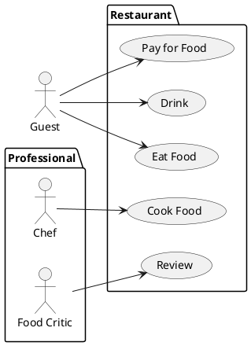
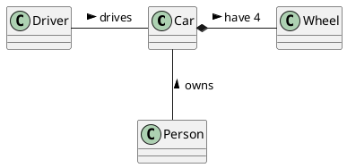

# Student information system - [*module title*]

[*Module description*]

## Functional Requirements

This section specifies the functional requirements.

### User requirements

Students
  - As a student, I should be able to see my current state of study because I want to be informed.
  - As a student, I should be able to edit my personal information because some event in my life can happen.
  - As a student, I should be able to change which information about myself I make visible to the public because I do not feel comfortable sharing everything.
  - As a student, I should be able to see the public information of other students because I may want to contact the person.
  - As a student, I should be able to generate confirmation documents of my studies because some organization may want it provided.
Study department/admin
  - As the study department, we should be able to add new users, and also remove them, because we decide who is our employee/student.
  - As the study department, we should be able to alter anyone's information because we are the admin and if students can we also can.
  - As the study department, we should be able to see anyone’s information because we are all knowing.
Employees
  - As an employee, I should be able to view my personal information because what is the point otherwise.
  - As an employee, I should be able to view my position because I want to keep myself posted.
  - As an employee, I should be able to edit my information in case there is a change.
  - As an employee, I should be able to generate confirmation documents of my employment, because I might need them for confirmation by third party.
All users
  - As any user, I should be able to display information publicly about myself, because I may want others to see them.
  - As any user, I should be able to see information about others that is made public because I might want to get into contact with them.

### System requirements

[*Document here your system requirements as use case diagrams.*]

#### Actors

[*Document here all actors from the use case diagrams. Make a subsection for each actor and their short description in each subsection.*]

##### [*Actor name*]

[*Actor description*]

#### Use cases

[*Document here all use cases. Create a subsection for each use case diagram. If you have only one use case diagram, you do not need a special subsection*]

##### [*Use case diagram title*]

[*Use case diagram in PlantUML*]

To be able to embed PlantUML diagrams to Markdown code with previews in VSCode you need
* Markdown All in One extension
* PlantUML extension
* Mardown Plantuml Preview extension

Follow https://plantuml.com/

[*Describe the diagram in a short paragraph. Describe each use case from the diagram in the detail from the lecture in a separate subsection.*]

###### [*Use case title*]

[*Use case description in the structure from the lecture.*]

[*Add an activity diagram for one use case per a team member*]

## Information model

[*Express the information model of the domain as a UML class diagram in PlantUML. Do not use class methods in the diagram, only classes, class attributes and associations connecting classes.*]

[*Document each class with a short description in a separate subsection*]

### [*Class name*]

[*Class description*]
