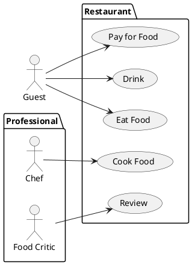
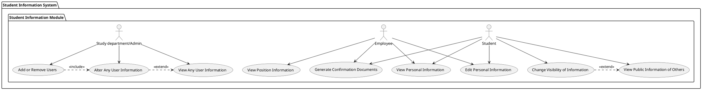

# Student information system - Personal information section

The Personal Information Module is specifically designed to efficiently handle the management of individual personal details within the university system. Its primary functions encompass streamlining processes like the collection and organization of personal information during the admission phase, as well as the ongoing tracking of enrollment in various study programs.

Users of this module have the ability to search for other individuals and access their personal information. Notably, each user has the flexibility to define which aspects of their information are visible to others, allowing for a customizable and controlled sharing of personal details.

This versatile module facilitates the creation of personalized admission procedures tailored to specific study programs and academic years. It plays a crucial role in recording admission outcomes for individual participants and tracking whether admitted students have successfully enrolled in their respective studies before the commencement of the first academic year.

In addition to its core functions, the Personal Information Module offers a valuable feature that allows users to generate confirmation documents for their studies. This capability streamlines the process of obtaining official confirmation of enrollment, providing users with a convenient and efficient way to validate their academic status.

As the academic journey progresses, the module continues to manage the recording of personal information, providing the flexibility to update details in response to events such as changes in residence or shifts in academic faculties.

Users maintain access to both their personal details and those of others through the module, with the level of visibility determined by individual preferences. This nuanced control ensures that personal information can be selectively shared, enhancing privacy and data security. The Personal Information Module thus serves as a comprehensive and user-friendly tool for managing and accessing personal information within the university system

## Functional Requirements

This section specifies the functional requirements.

### User requirements

**Students**
  - As a student, I should be able to see my current state of study because I want to be informed.
  - As a student, I should be able to edit my personal information because some event in my life can happen.
  - As a student, I should be able to change which information about myself I make visible to the public because I do not feel comfortable sharing everything.
  - As a student, I should be able to see the public information of other students because I may want to contact the person.
  - As a student, I should be able to generate confirmation documents of my studies because some organization may want it provided.

**Employees**
  - As an employee, I should be able to view my personal information because what is the point otherwise.
  - As an employee, I should be able to view my position because I want to keep myself posted.
  - As an employee, I should be able to edit my information in case there is a change.
  - As an employee, I should be able to generate confirmation documents of my employment, because I might need them for confirmation by third party.

**Study department/admin**
  - As the study department, we should be able to add new users, and also remove them, because we decide who is our employee/student.
  - As the study department, we should be able to alter anyone's information because we are the admin and if students can we also can.
  - As the study department, we should be able to see anyone’s information because we are all knowing.

**All users**
  - As any user, I should be able to display information publicly about myself, because I may want others to see them.
  - As any user, I should be able to see information about others that is made public because I might want to get into contact with them.

### System requirements

- ***Students***
- ***Employees***
- ***Study department/admin***
- ***All users***

**Students**
- A student is a person studying at a university.
- They can send admission requests.
- They are able to view and edit their personal information.

**Employees**
- An employee is a person employed by the university.
- They can apply for a job.
- They can view and edit their personal information.

**Study department**
- The study department manages admission procedures and records whether admitted students are enrolled or not.

**All users**
- This represents any of the previous actors (All users of sis).

[*Document here your system requirements as use case diagrams.*]

#### Actors

[*Document here all actors from the use case diagrams. Make a subsection for each actor and their short description in each subsection.*]

##### [*Actor name*]

[*Actor description*]

#### Use cases

[*Document here all use cases. Create a subsection for each use case diagram. If you have only one use case diagram, you do not need a special subsection*]

##### [*Use case diagram title*]

[*Use case diagram in PlantUML*]

To be able to embed PlantUML diagrams to Markdown code with previews in VSCode you need
* Markdown All in One extension
* PlantUML extension
* Mardown Plantuml Preview extension

Follow https://plantuml.com/

[*Describe the diagram in a short paragraph. Describe each use case from the diagram in the detail from the lecture in a separate subsection.*]

###### [*Use case title*]

[*Use case description in the structure from the lecture.*]

[*Add an activity diagram for one use case per a team member*]

## Information model

[*Document each class with a short description in a separate subsection*]

### [*Class name*]

[*Class description*]
